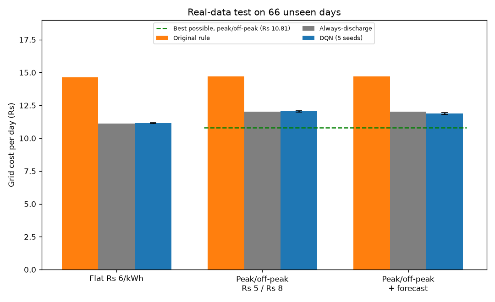

# AI-Driven Energy Management for a Solar + Battery Microgrid (Deep Q-Network)

I built an AI agent that manages a small microgrid (solar panel, battery, and grid connection). Every hour it decides how to use the power so that the house load is always served and the grid bill is as low as possible. The agent is a **Deep Q-Network (DQN) written from scratch in PyTorch**, with no RL library such as Stable-Baselines3, because I wanted to understand and explain every part: the network, the replay buffer, the target network and the exploration.

I first trained it on a simulator. Then I tested it on **real solar data from Lucknow and real household load data**, compared it with fair baselines, and measured how much saving is actually possible. This README explains the whole process, including the results that did not go the way I first expected.

---

## Results at a glance

All costs are grid cost per day in rupees (₹), measured on **66 unseen test days** spread over all months, with 5 random training seeds for the DQN.

| Setting | Original rule | Always-discharge (solar, then battery, then grid) | DQN |
|---|---|---|---|
| Flat tariff, ₹6/kWh | 14.63 | 11.12 | 11.15 ± 0.02 |
| Peak/off-peak what-if, ₹5 / ₹8 | 14.71 | 12.01 | 12.05 ± 0.06 |
| Peak/off-peak what-if + same-day forecast | 14.71 | 12.01 | **11.87 ± 0.06** |

A perfect-foresight plan on the peak/off-peak tariff costs ₹10.81 per day, so the best possible saving over always-discharge is 10.0%.


**What this means, in plain words**
- On the simulator only, the DQN cut cost by about 90% versus the original rule. That result did **not** carry over to real data (see section 7).
- The "original rule" buys grid power to charge the battery. Under a flat tariff that loses money, so beating it is easy. Against a fair solar-first rule, the DQN ties (within 0.3%).
- When the DQN is also given a same-day forecast of solar and load, it becomes about **1.1% cheaper** than the solar-first rule under peak/off-peak prices. All 5 seeds improved, but the gain is small: it captures about 11% of the savings a perfect-foresight plan could get.
- Main lesson: for a grid-connected home with a small battery, a simple solar-first rule is already close to what a learned policy can do, unless the policy knows what is coming.

---

## Contents

1. [The problem](#1-the-problem)
2. [How I thought about it](#2-how-i-thought-about-the-problem)
3. [The microgrid model](#3-the-microgrid-model)
4. [The DQN agent](#4-the-dqn-agent)
5. [Baselines](#5-baselines)
6. [Real data](#6-real-data)
7. [Experiments and results, step by step](#7-experiments-and-results-step-by-step)
8. [Key findings](#8-key-findings)
9. [Limitations](#9-limitations)
10. [Repository structure](#10-repository-structure)
11. [How to reproduce](#11-how-to-reproduce)
12. [Future work](#12-future-work)
13. [Tools](#13-tools)

---

## 1. The problem

A home has a solar panel, a battery and a grid connection. Each hour there is a choice to make: use solar directly, store it, use the battery, or buy from the grid. Buying costs money, and solar that cannot be used or stored is wasted. The goal is to keep the lights on at all times while spending as little as possible on grid electricity and using as much free solar energy as possible.

## 2. How I thought about the problem

Before writing code, I listed the real situations the system has to handle:

1. **Sun is strong, load is low.** Solar covers the load and the extra charges the battery. No grid power is needed.
2. **Sun is strong but the battery is full.** The extra solar has nowhere to go and is wasted (curtailment). A smart system keeps some room in the battery ahead of peak sun.
3. **No sun, but the battery has charge.** The battery powers the load. No grid needed.
4. **No sun and the battery is nearly empty.** The battery may not go below 20% charge, to protect its life. The grid must supply the load and can recharge the battery.
5. **Battery recharged above the floor.** The system goes back to solar and battery first.
6. **High evening load while the sun fades.** The battery gives what it can and the grid fills only the remaining gap.
7. **Off-peak cheap electricity.** The system may choose to top up the battery now, to avoid buying expensive power later.
8. **Changing weather.** Solar output changes by weather each day, so the agent must react to what is happening instead of memorising one pattern.

These are enforced as real physics in the code, not just described in this report. For example, the battery genuinely cannot discharge below 20% whatever action is chosen.

## 3. The microgrid model

The environment is in `microgrid_env.py`. It simulates one day as 24 one-hour steps.

**System parameters**

| Item | Value |
|---|---|
| Solar array | 1 kW peak |
| Battery | 2 kWh, 95% efficiency each way |
| Battery limits | hard floor 20% (cannot discharge below), soft ceiling 95% (penalised above) |
| Grid charging limit | 400 Wh per hour |
| Load range | 100 W to 800 W |

**Order in which the load is served (the physics):** solar first, then battery (never below the 20% floor), then grid. So the load is always served while the grid is on. Any extra solar first charges the battery, and only what does not fit is curtailed.

**State (6 inputs):** solar output, load, battery charge, hour of day (sine and cosine), and price signal.

**Actions (3):** 0 = charge from the grid (only when there is room and the price is the cheap one), 1 = discharge the battery, 2 = idle.

**Reward:** minus the grid cost, plus a small bonus (0.05 per kWh) for solar that serves the load directly, minus a small penalty (0.05 per kWh) for curtailed solar, minus 0.5 if the battery goes above 95%. A lower bill gives a higher reward.

In the original simulator, solar follows a bell curve scaled by a daily weather factor (clear 60% of days, partly cloudy 25%, overcast 15%), and the load has morning, lunch and evening peaks with noise.

## 4. The DQN agent

The agent is in `dqn_agent.py`: a feed-forward Q-network (hidden size 128), an experience replay buffer, a separate target network that is updated periodically, and epsilon-greedy exploration that decays over training.

| Hyperparameter | Value |
|---|---|
| Learning rate | 0.002 |
| Batch size | 32 |
| Target network update | every 1,000 steps |
| Epsilon decay | over 5,000 steps |
| Discount factor (gamma) | 0.95 |

I chose these with a small random search on the simulator (`tune_hyperparams.py`). I reused the same values for all the real-data experiments and did not re-tune them there.

## 5. Baselines

A result only means something against a fair opponent, so I compare against two rules:

- **Original rule** (`rule_based_ems.py`): if the battery is below 35% and the price signal says "cheap", charge from the grid; otherwise discharge. It was designed for time-of-day pricing.
- **Always-discharge** (the fair baseline): always use solar first, then the battery, then the grid. It never buys grid power just to charge the battery.

I added the second baseline after finding that the first one loses money under a flat tariff (see section 7).

## 6. Real data

**Solar.** NASA POWER hourly all-sky surface shortwave irradiance for Lucknow (latitude 26.85, longitude 80.95), the full year 2024, in local solar time: 8,784 hours, no missing values. I convert irradiance to panel output for the 1 kW array with a performance ratio of 0.8 (`output = irradiance / 1000 × 1000 W × 0.8`).

**Load.** The UCI Individual Household Electric Power Consumption dataset: one household in France, measured every minute from 2006 to 2010. I averaged it to hourly values, kept the 1,417 complete days, and scaled it so the average load is 215 W (the same size as the simulated home, so it fits a 1 kW / 2 kWh system). This is not Indian load data; it is the best freely available real household profile I found (see Limitations).

**Pairing.** Each solar day is paired with a load day from the **same calendar month**, so winter solar meets winter load.

**Train / validation / test split.** By day of the month: days 1 to 21 train, days 22 to 25 validate, days 26 to 31 test. This puts every season in every split. That gives 48 validation days and 66 test days that the agent never sees during training. The best checkpoint of each run is chosen on the validation days, and the test days are used only once for the final number.

**Training.** 60,000 steps (about 2,500 simulated days), evaluated on the validation days every 10,000 steps, repeated for 5 random seeds (0 to 4).

**Tariff.** UPPCL domestic (LMV-1) energy rates in Lucknow are slab-based at roughly ₹5.50 to ₹6.50 per unit (published sources differ a little on the exact slab boundaries, so check your bill). I use a **flat ₹6.00/kWh**. I found no time-of-day pricing for domestic users. The fixed charge (₹110 per kW per month) is excluded because it is the same whatever the controller does. Peak/off-peak prices (₹5 off-peak, ₹8 from 09:00 to 21:00) are used only as a labelled what-if.

## 7. Experiments and results, step by step

This is the order in which I ran things and what each one taught me.

**Step 1. Simulator result.** Trained and evaluated on the simulator (20 test days, same days for both policies).

| Metric | Rule-based | DQN |
|---|---|---|
| Average daily grid cost | $0.103 | $0.010 |
| Solar utilisation | 53.3% | 58.5% |
| Solar curtailed per day | 3,952 Wh | 3,493 Wh |

That is a 90% lower cost, but it is a **simulation-only** number, and the absolute amounts are tiny (about 10 cents versus 1 cent per day).

**Step 2. Reality check on real data.** I ran the simulator-trained DQN on 30 real June days (Lucknow solar plus real household load), with no retraining. It **lost**: ₹17.03 per day versus ₹11.44 for the rule. The agent had never seen real weather or a real load shape.

**Step 3. Retrain on real data.** I retrained on 20 real June days and tested on 10 unseen ones: rule ₹9.83, simulator-trained DQN ₹15.54, retrained DQN ₹6.62 (32.6% better than the rule). This was promising, but the sample was tiny and used one seed.

**Step 4. Full year, proper split, 5 seeds.** With a year of solar, the day-of-month split and 5 seeds, the DQN cost ₹11.18 ± 0.06 versus ₹14.91 for the rule (25.0% better), on all 66 test days.

**Step 5. Finding a flaw in my own comparison.** Reading the rule closely, it buys grid power to charge the battery whenever the price signal looks cheap. That only pays when prices change through the day. Under my real flat tariff it is a pure loss (and the battery loses energy each time it charges and discharges). On sunny days the rule paid exactly ₹3.00, which is 500 Wh of grid energy. So part of the 25% was the baseline making a mistake, not the DQN being clever. I therefore added the always-discharge baseline and re-ran everything.

**Step 6. Fair test on the flat tariff.** DQN and all policies in a flat-price world: original rule ₹14.63, always-discharge ₹11.12, DQN ₹11.15 ± 0.02. The DQN beat the original rule by 23.7% but **tied** the fair baseline (0.3% worse). Under a flat price with a working grid, buying power to store it is a loss, so there is little for a learned policy to add.

**Step 7. Does a peak/off-peak tariff help the DQN?** Trained and tested with ₹5 off-peak and ₹8 peak prices: original rule ₹14.71, always-discharge ₹12.01, DQN ₹12.05 ± 0.06. Again the DQN tied the fair baseline.

**Step 8. Is there any saving to find? A perfect-foresight ceiling.** For each test day I computed the lowest possible cost using dynamic programming over battery charge, assuming the whole day's solar and load are known in advance (`oracle_tod.py`). It costs ₹10.81 per day, which is 10.0% below always-discharge. So savings exist, and the DQN was missing all of them. This ceiling is optimistic, because no real controller knows the day in advance.

**Step 9. Give the DQN a forecast.** I added two inputs to the state: the expected solar and expected load for the rest of the day, each with a random 15% forecast error. Result: ₹11.87 ± 0.06, which is 1.1% cheaper than always-discharge, with all 5 seeds better (0.3% to 1.9%). That captures about 11% of the possible savings.

**How the headline changed as I tested more carefully**

| Stage | DQN versus | Result |
|---|---|---|
| Simulator | original rule | 90% better (simulation only) |
| Real June days, no retraining | original rule | 49% worse |
| Real June days, retrained | original rule | 32.6% better (10 days, 1 seed) |
| Full year, proper split | original rule | 25.0% better (unfair baseline) |
| Flat tariff, fair baseline | always-discharge | 0.3% worse (tie) |
| Peak/off-peak, fair baseline | always-discharge | 0.3% worse (tie) |
| Peak/off-peak + forecast | always-discharge | 1.1% better |

## 8. Key findings

1. A result from a simulator does not automatically hold on real data. The simulator-trained agent lost on real days.
2. The choice of baseline decides the story. Against a rule that wastes money under a flat tariff, the DQN looked excellent. Against a fair solar-first rule, it only ties.
3. With a working grid and a flat tariff, the best policy is very simple: use solar, then the battery, then the grid.
4. Savings exist when timing matters (peak/off-peak prices), but a DQN that sees only the current hour cannot find them. Telling it what is coming (a forecast) starts to help.
5. Testing on unseen days, over several seeds, with a perfect-foresight ceiling, made the conclusions much more reliable than a single run.

## 9. Limitations

- The load data comes from one household in France, scaled down. Only the solar is from Lucknow.
- The peak/off-peak tariff is a what-if; the UPPCL domestic tariff is slab-based. Slab-wise monthly billing is approximated by a flat ₹6/kWh, and the fixed charge is excluded.
- The 15% forecast error is an assumption. A real forecast would come from a weather service.
- Each simulated day starts at 50% battery charge, and leftover charge at the end of the day has no value, so days are independent. Part of the perfect-foresight ceiling may come from this setup.
- Test days come from the same year and months as the training days, so weather patterns may be slightly correlated with training.
- One year of solar data, one location, and one system size (1 kW solar, 2 kWh battery).
- The grid is assumed to be always available. Hyperparameters were tuned on the simulator only.
- The Streamlit dashboard runs on the simulator with the simulator-trained model, so its cost comparison is simulation-only.

## 10. Repository structure

| File | What it does |
|---|---|
| `microgrid_env.py` | The microgrid simulator (solar, load, battery, grid, weather, physics) |
| `dqn_agent.py` | DQN from scratch in PyTorch (network, replay buffer, target network) |
| `rule_based_ems.py` | The original threshold rule used as a baseline |
| `tune_hyperparams.py` | Random search for DQN hyperparameters (on the simulator) |
| `prepare_load_all.py` | Downloads the UCI household data and builds `household_load_all.csv` |
| `train_eval_year.py` | Shared data pipeline (loads data, builds the split) and the real-data environment. Its own run is the superseded full-year test from step 4 |
| `train_eval_flat.py` | Flat tariff experiment with both baselines (step 6) |
| `train_eval_tod.py` | Peak/off-peak what-if (step 7) |
| `oracle_tod.py` | Perfect-foresight ceiling (step 8) |
| `train_eval_tod_forecast.py` | DQN with a same-day forecast (step 9) |
| `app.py` | Streamlit dashboard (simulator only) |
| `lucknow_solar_2024.csv`, `household_load_all.csv` | Real data files |
| `models/` | Trained models and the training curve |
| `results/` | Comparison plots from the original simulator evaluation |

The original simulator scripts (`train_agent.py` and `evaluate.py`) were replaced by the real-data scripts above; they remain in the early commits of this repository.

## 11. How to reproduce

```bash
python -m venv venv
venv\Scripts\activate            # source venv/bin/activate on Linux/Mac
pip install -r requirements.txt  # includes torch, numpy, pandas, matplotlib, streamlit, ucimlrepo
```

1. **Download the solar data** by opening this link in a browser and saving the file as `lucknow_solar_2024.csv` in the project folder (the scripts skip its 9 header lines):

   ```
   https://power.larc.nasa.gov/api/temporal/hourly/point?parameters=ALLSKY_SFC_SW_DWN&community=RE&longitude=80.95&latitude=26.85&start=20240101&end=20241231&format=CSV&time-standard=LST
   ```

2. **Build the load data** (downloads the UCI dataset, takes a minute or two):

   ```bash
   python prepare_load_all.py
   ```

3. **Run the experiments.** Each of the 5-seed scripts takes roughly 15 to 60 minutes on a laptop CPU:

   ```bash
   python train_eval_flat.py          # flat tariff, both baselines
   python train_eval_tod.py           # peak/off-peak what-if
   python oracle_tod.py               # perfect-foresight ceiling
   python train_eval_tod_forecast.py  # DQN with forecast
   ```

   `train_eval_tod_forecast.py` uses the ceiling value ₹10.81 from `oracle_tod.py`. If you change anything, copy the new number into the `ORACLE_RS` line at the top of the file.

4. **Dashboard (simulator):**

   ```bash
   streamlit run app.py
   ```

## 12. Future work

- Run days back to back so the battery charge carries over from one day to the next.
- Use real Indian household load data (for example from smart-meter studies) in place of the French household.
- Replace the assumed forecast error with an actual forecasting model trained on weather data.
- Try stronger learning methods (Double DQN, actor-critic with continuous charge and discharge power) and longer training.
- Use several years and several locations, and model slab billing across a whole month.
- Test different battery and solar sizes to see where a learned policy starts to pay off.

## 13. Tools

Python, PyTorch, NumPy, Pandas, Matplotlib, Streamlit. Data: NASA POWER (solar) and the UCI Machine Learning Repository (household load).